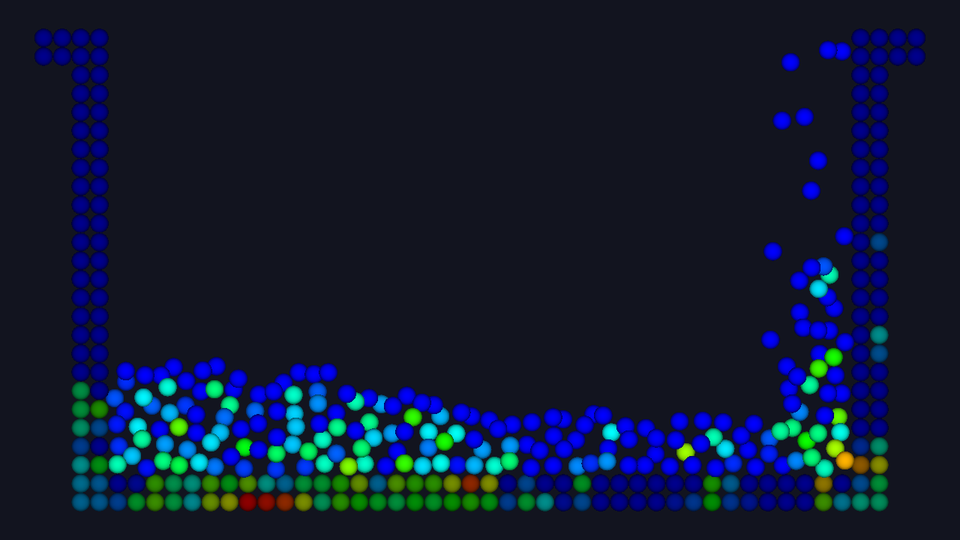
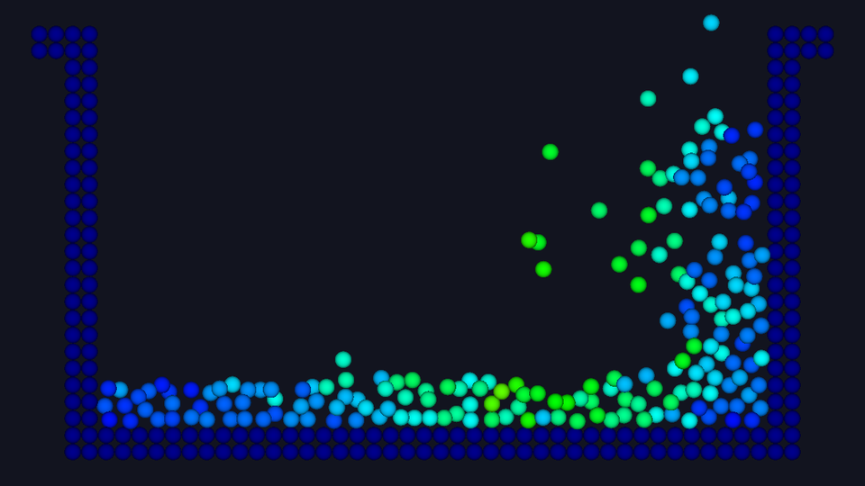
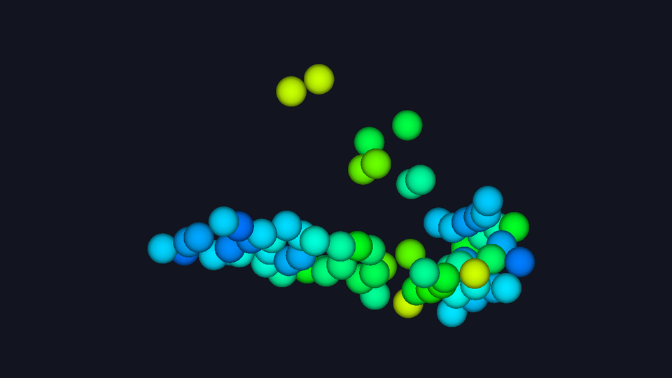

# mps-chapter2

粒子法（**MPS法** / Moving Particle Semi-implicit method）による非圧縮性流体シミュレーションと、
その結果を **DirectX 11** でアニメーション表示するビューア。

計算対象は**ダムブレイク（ダム崩壊）問題**。水槽の左端に置いた水柱が重力で崩れ、
右へ流れ広がって壁を駆け上がる様子を 2 秒間計算する。
自由表面が激しく変形する現象であり、格子法が苦手とする領域で粒子法の利点が出る。

| 初期配置（粒子種類） | 圧力分布 t = 0.5 s |
|---|---|
|  |  |

| 速度分布 t = 0.8 s | 3次元計算 t = 0.72 s |
|---|---|
|  |  |

青＝低い / 赤＝高い（jet カラーマップ）。灰色は壁粒子。

---

## 構成

| ファイル | 内容 |
|---|---|
| `mps.c` | MPS法ソルバ（C）。全関数・全変数に日本語の詳細コメント付き |
| `mps_viewer.cpp` | DirectX 11 ビューア（C++） |
| `build.bat` | 上の 2 つを一括ビルド（Visual Studio を自動検出） |
| `技術解説書.pdf` | 理論・実装・操作方法の解説（27ページ） |
| `技術解説書.md` | 上の PDF のソース |
| `make_pdf.bat` | `技術解説書.md` から PDF を作り直す |
| `pdf_tools/` | PDF 変換用の補助スクリプト |
| `mps_original_backup.c` | `mps.c` のオリジナル（コメント追加前） |

---

## 必要環境

- Windows 10 / 11
- Visual Studio 2017 以降（**「C++ によるデスクトップ開発」ワークロード**）
- レガシーの DirectX SDK (June 2010) は**不要**。DirectX 11 は Windows SDK 10 に同梱

PDF を作り直す場合のみ追加で必要：

- Python 3 … `pip install markdown pypdf reportlab`
- Google Chrome（無ければ Microsoft Edge）

---

## 使い方

```
build.bat          ビルド（mps.exe と mps_viewer.exe ができる）
   ↓
mps.exe            計算（2次元:約25秒 / 3次元:約7分）
   ↓
mps_viewer.exe     アニメーション再生
```

`build.bat` は `vswhere.exe` で Visual Studio を自動検出するので、
「開発者コマンドプロンプト」を開く必要はない。

`mps.exe` は計算結果をカレントフォルダに書き出す。

- `output_%04d.prof` … ビューアが読むテキスト形式
- `particle_%04d.vtu` … ParaView などで開ける VTK 形式

`mps_viewer.exe` は同じフォルダの `.prof` を全部読み込んで再生する。
別のフォルダを見せたいときは引数で渡す：`mps_viewer.exe D:\結果フォルダ`

### ビューアの操作

| キー | 動作 |
|---|---|
| `Space` | 再生 / 一時停止 |
| `→` `←` | コマ送り |
| `Home` | 先頭へ |
| `1` `2` `3` `4` | 圧力 / 速度 / 粒子種類 / 粒子数密度 で色分け |
| `+` `-` `0` | 再生速度を上げる / 下げる / 等倍に戻す |
| `[` `]` | カラースケールの上限を下げる / 上げる |
| `W` `D` | 壁 / ダミー壁の表示切替 |
| `,` `.` | 粒子の描画半径を小さく / 大きく |
| `F` | 表示範囲を戻す |
| `F12` | 静止画を `shot_%03d.bmp` に保存 |
| `Esc` | 終了 |

マウスは**左ドラッグで回転**（3次元向け）、右ドラッグで平行移動、ホイールで拡大縮小。

### コマンドラインオプション

```
mps_viewer.exe [結果フォルダ] [オプション]

  -r <半径>            粒子の描画半径 [m]（省略時はデータから自動推定）
  -c <0-3>             起動時の配色（0:圧力 1:速度 2:種類 3:粒子数密度）
  -wall / -nowall      壁粒子を表示する / しない
  -yaw <度> -pitch <度>  起動時のカメラ角度（3次元向け）
  -shot <番号> <出力.bmp>  画面を出さずに指定フレームを保存して終了
```

---

## 2次元 / 3次元の切り替え

`mps.c` 冒頭の `#define` ブロックで、使いたいほうの 4 行を有効にする
（不要なほうは行頭に `//` を付ける）。書き換えたら `build.bat` からやり直す。

```c
/* ----- 2 次元計算用 ----- */
//#define DIM                  2
//#define PARTICLE_DISTANCE    0.025
//#define DT                   0.001
//#define OUTPUT_INTERVAL      20

/* ----- 3 次元計算用（現在有効） ----- */
#define DIM                  3
#define PARTICLE_DISTANCE    0.075
#define DT                   0.003
#define OUTPUT_INTERVAL      2
```

| | 2次元 | 3次元 |
|---|---|---|
| 粒子間距離 l₀ | 0.025 m | 0.075 m |
| 総粒子数 | 584 | 2,680 |
| うち流体粒子 | 200 | 72 |
| タイムステップ数 | 2,000 | 667 |
| 出力フレーム数 | 101 | 334 |
| 計算時間（x64 Release） | 24 秒 | 6.7 分 |
| 出力データ量 | 約 8 MB | 約 123 MB |

3次元では粒子間距離を 3 倍粗くしてある。粒子数は解像度の 3 乗で効くため、
2次元と同じ 0.025 のままにすると数十万粒子になり、
下記の O(N³) ソルバでは現実的な時間で終わらないからである。

3次元では壁が閉じた箱になり、外から見ると壁しか見えない。
そのためビューアは 3次元データを読むと**壁を自動的に非表示**にする（`W` で切替）。

---

## 実装メモ

### ソルバ側

MPS法の 1 ステップは 3 段階からなる。

1. **陽的計算** — 重力と粘性で仮の速度・位置を求める
2. **陰的計算** — 非圧縮条件を満たす圧力をポアソン方程式 `[A]{P}={b}` から求める
3. **修正** — 圧力勾配で速度・位置を補正して確定させる

計算時間の大半は 2 の連立一次方程式の求解が占める。
可読性を優先してガウスの消去法（**O(N³)**）で書かれており、
近傍粒子探索も全粒子総当たり（**O(N²)**）である。
実用規模では ICCG 法とバケット法への置き換えが必要になる。

### ビューア側

- 粒子は**インスタンシング**で描画する。4 頂点の正方形を `DrawInstanced()` 1 命令で
  粒子数ぶん描き、ピクセルシェーダで円形にくり抜いて球のように見せる
- HLSL は実行時コンパイル（`D3DCompile`）。`.hlsl` ファイルも `fxc` も不要
- **正射影**を採用。遠近感がないので 2次元計算の水槽が歪まず、水位を目で読み取れる
- カラースケールの上限は最大値ではなく **99 パーセンタイル**を使う。
  圧力は衝突の瞬間に一部の粒子だけ極端な値（実測 15,585 Pa）になるため、
  最大値を上限にすると大半の粒子が青一色に潰れてしまう

詳細は `技術解説書.pdf` を参照。

---

## 原典

```
mps.c
(c) Kazuya SHIBATA, Kohei MUROTANI and Seiichi KOSHIZUKA (2014)
Fluid Simulation Program Based on a Particle Method (the MPS method)
```

`mps.c` は上記のサンプルコードを基にしている。
Visual C++ でビルド・実行できるよう調整し、日本語コメントを追加したもので、
**計算式・アルゴリズムは変更していない**（オリジナルは `mps_original_backup.c`）。

再配布条件は原典の定めに従うこと。
